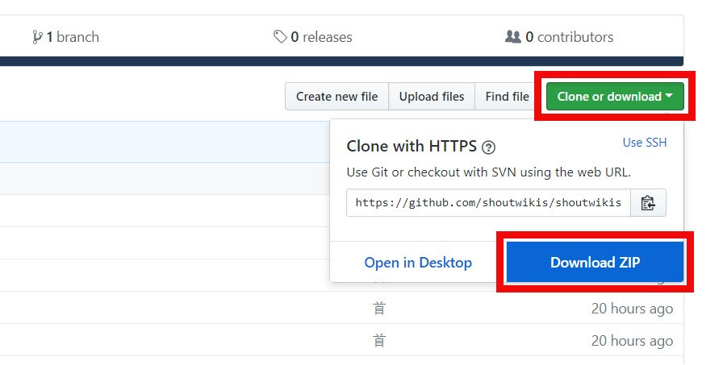

## 注意：勿将工具外传于野队
## 注意：封号等后果自负
## 注意：用自动工具前，务必把贵重物品移出随身包，以绝其被工具变卖的可能

## 下载办法：
办法1 | 办法2 (安装 Github Desktop，以简化日后的下载操作)
--- | ---
 | **点击：** [下载演示](https://www.bilibili.com/video/av21499125) 

## 各工具简介

工具名 | 说明/用途  
--- | ---
激战助手 | 快速团，自动服用补品，买卖 等
**通用工具**
冰鸟工具 | 节日品，铁，钢，土
灾难黑石 | 土，黑曜石
物资工具 | 战承物资，黑檀先锋队称号 (游侠)
断人+防断+技能记录 | 重启工具时，会删除以往的技能记录
阿斯卡隆保卫者 | 毁灭前称号
翻译 | 翻译各频道内的内容
开图工具 | 完整开图工具
神唤刷羽毛 | 羽毛
拆解工具 | *无特别说明*
刷鳞翅 | 鳞翅 (用以制作三章补品)，无需求镰刀
刷雪人 | 戴尔狄摩称号 (游侠)，低需求，有铸印的匕首
刷纤维 | 纤维 (暂无保留贵重盾的功能)
三章刷分 | 主线任务：刷称号用，在犹朗避难所外
**节日工具**
农历新年工具 | 做三章补品时，也可用此内的易物工具
万圣节工具 | *无特别说明*
冬庆节工具 | *无特别说明*
**高危工具**
柯达工具 | *无特别说明*
翡翠工具 | 尚未上传
未经测试的野队工具 | *警告： 这些是未测试的，可能有病毒的，大部分不工作，需要自行修改*
**调试工具**
数据读取 | *无特别说明*
行程记录 | *无特别说明*
测试 | 制作工具时，测试功能用

## 若需留言，可用QQ